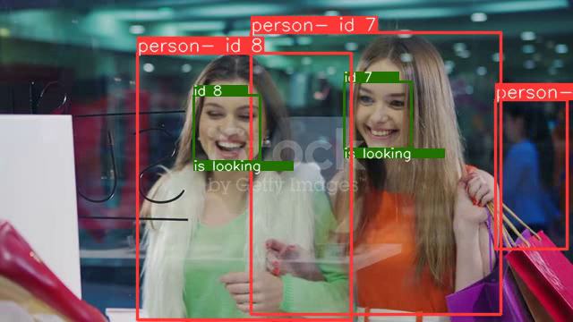
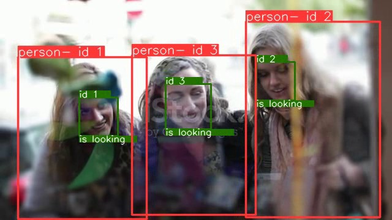

# Vehicle tracking with Yolov5 + Deep Sort with PyTorch

<p>
    

</p>


## Requirements

Python 3.7.12 

```
pip install -r requirements.txt
```

    
## Running tracker

```
cd application\main
python app_track.py
```


## FastAPI

```
cd application\main
uvicorn app_API:app --host 0.0.0.0 --port 8000 --reload

```


